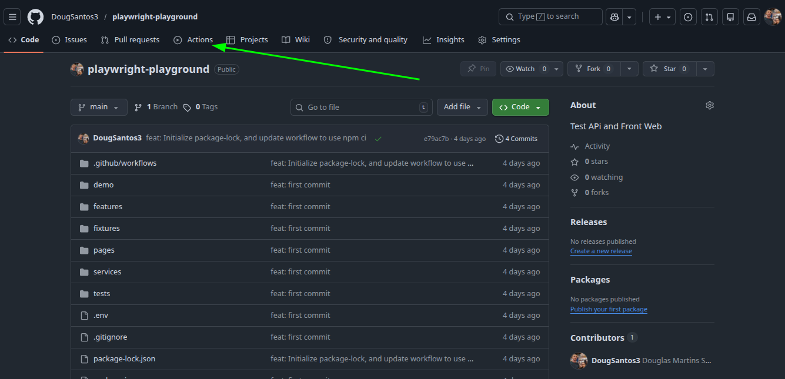
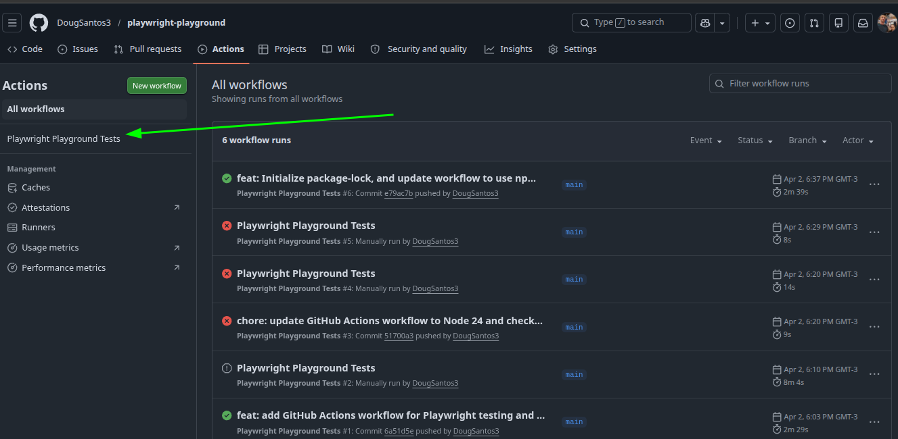
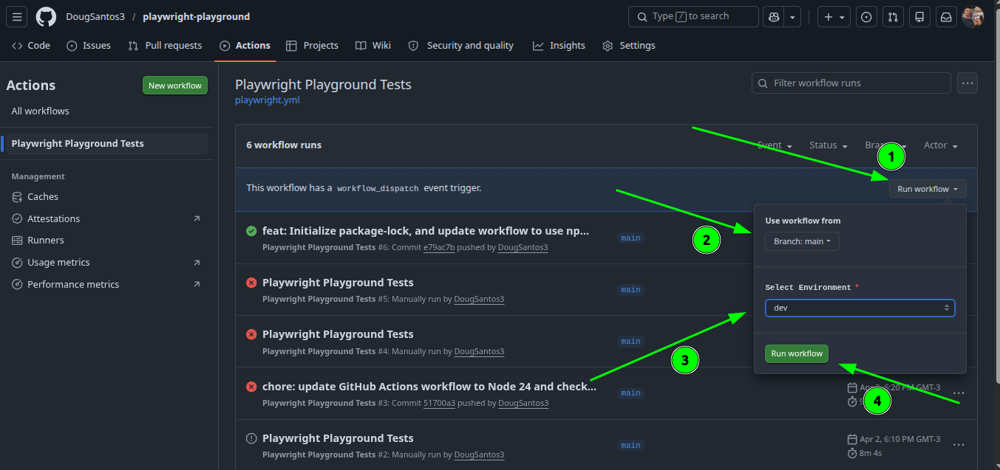
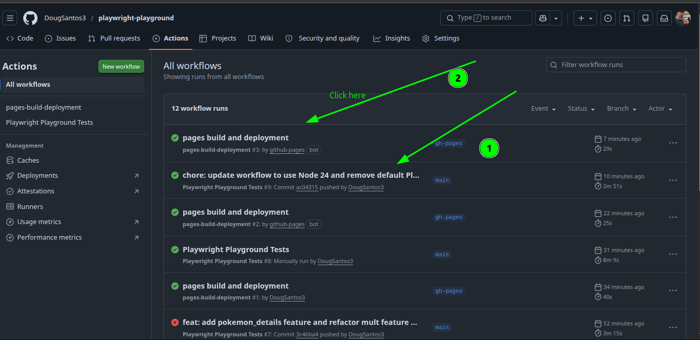
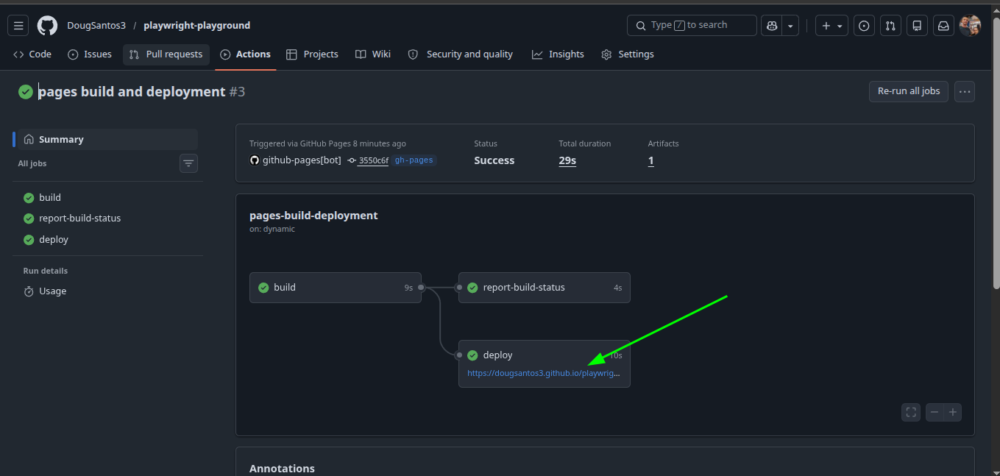
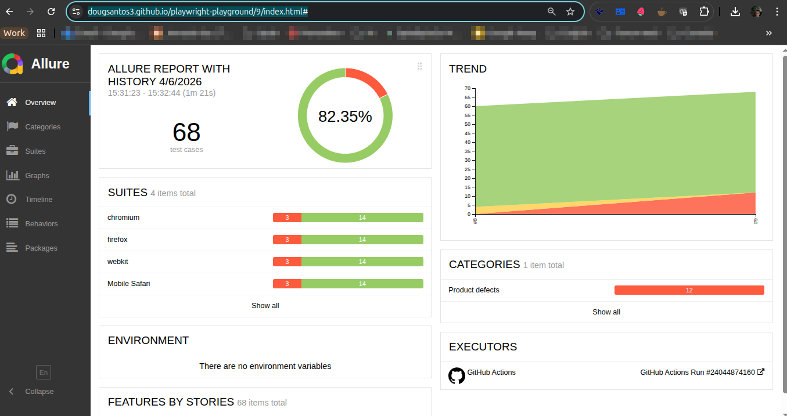

<div align="center">
  

  # 🎭 Playwright Playground

  An enterprise-grade End-to-End & API testing playground built with **Playwright**.
  Designed to demonstrate advanced QA automation strategies, including Mocking, Hybrid Testing, Data-Driven strategies, and BDD.

  <p>
    
    
    
    
  </p>
</div>

---

## 🚀 Welcome to the Project!

This project is an **excellent reference and practical playground**, perfectly suited for both beginners and advanced professionals across **QA, Development, and DevOps**. 
It serves as a practical showcase of modern test automation capabilities. Instead of basic CRUD tests, this project delves into **real-world scenarios** you encounter in modern web applications.

Feel free to explore the code, copy implementations for your own projects, or share it with your network!

## 💡 Key Highlights

This project stands out by implementing advanced testing patterns:

- 🔀 **Full-Stack Hybrid Testing:** End-to-End scenarios that combine Page Object Models (POM) for UI navigation alongside API service classes to validate data integrity across frontend and backend simultaneously.
- 🎭 **Network Mocking & Interception:** Validates frontend UI states by using Playwright's `page.route` to mock API responses. This allows testing successful UI states and graceful error handling without relying on backend stability.
- 📊 **Data-Driven API Validation:** Runs parameterized and dynamic test scenarios using data sets to rigorously test APIs across multiple input variations.
- 🥒 **BDD Integration:** Cucumber-based feature files (written in Gherkin) that validate behavioral flows directly on the user interface, ensuring tests are readable by both technical and business stakeholders.
- 🤖 **CI/CD & GitHub Pages:** Continuous Integration pipelines using GitHub Actions, integrated with GitHub Pages to automatically host and display test reports online.
- 📈 **Allure Reports Integration:** Comprehensive and visually appealing test reports with step-by-step trace viewing.

## 📂 Project Structure

### API Tests (`tests/`)
- 🧪 `api_pokemon.spec.js`: Validates the basic GET requests and return schemas for external APIs (e.g., Pokémon API).
- ⚠️ `api_errors.spec.js`: Dedicated scenarios covering edge cases, invalid inputs, and correct HTTP error statuses (404, 500, etc.).
- 🔄 `api_data_driven.spec.js`: Parameterized testing for robust coverage.

### UI & Hybrid Tests (`tests/`)
- 🕸️ `using_mocks.spec.js`: Intercepts network calls to simulate backend behaviors and assert UI reactions.
- 🧩 `hybrid_test.spec.js` & `final_challenge.spec.js`: Synthesizes UI actions and real API calls for true End-to-End coverage.

### Behavior Driven Development (`features/`)
- 📝 `pokemon_details.feature`: Actionable documentation and automated behavioral specifications using the Gherkin language.

## 🛠️ Getting Started

Want to run these tests locally? It's easy!

### Prerequisites
- [Node.js](https://nodejs.org/) (Recommended: **v24.14.1 LTS**)
- npm (v11+)

### Installation

1. **Clone the repository**
   ```bash
   git clone https://github.com/[Your_GitHub_Username]/playwright-playground.git
   cd playwright-playground
   ```

2. **Install dependencies**
   ```bash
   npm install
   ```
   *(Playwright browsers will be installed automatically or you can run `npx playwright install`)*

### Execution

The project is configured to run across **3 distinct environments**, automatically handling mock configurations:

```bash
# 1. Development (DEV) - Runs tests INCLUDING mocks (@mock)
npm run dev

# 2. Quality Assurance (QA) - Runs tests against staging, IGNORING mocks (real network)
npm run qa

# 3. Production (PROD) - Runs tests against production, IGNORING mocks (real network)
npm run prod
```

### 📊 Viewing the Results (Allure Report)

This project integrates Allure for beautiful reporting. Whenever you run a test script (`npm run dev`/`qa`/`prod`), the Allure report is generated automatically. To open and view it:

```bash
npm run allure:open
```

To clean up past report data:
```bash
npm run allure:clear
```

### 🤖 Continuous Integration with GitHub Actions

This project uses GitHub Actions to automate the testing process. The pipeline runs the test suite and generates the Allure Report automatically, publishing it to GitHub Pages. 

1. **Pipeline Execution:** Tests run automatically on PRs or pushes to the main branch.
2. **Report Generation:** Test results are processed and the Allure Report is built.
3. **Deployment to GitHub Pages:** The final report is hosted seamlessly for easy viewing.

➡️ **[View the Live Allure Report Here](https://dougsantos3.github.io/playwright-playground/)** *(Automatically updated with the latest execution!)*

<details>
<summary><b>📸 Click here to view the step-by-step pipeline execution screenshots</b></summary>
<br>

<table align="center">
  <tr>
    <td align="center"><b>1. Click on GitHub action</b><br></td>
    <td align="center"><b>2. Click on Playwright Playground Tests</b><br></td>
  </tr>
  <tr>
    <td align="center"><b>3. Choose an environment</b><br></td>
    <td align="center"><b>4. After the execution of the scenarios </b><br></td>
  </tr>
  <tr>
    <td align="center"><b>5. Clicking on the Report</b><br></td>
    <td align="center"><b>6. Live Results</b><br></td>
  </tr>
</table>
</details>


---

### 🤝 Let's Connect!
Let's connect on LinkedIn and Youtube:
- **Douglas Santos:** [https://www.linkedin.com/in/douglasmartinssantos/](https://www.linkedin.com/in/douglasmartinssantos/)
- **Community:** [VRaptor Code Academy Linkedin Page](https://www.linkedin.com/company/14864694/admin/page-posts/published/)
- **Community:** [VRaptor Code Academy Youtube Channel](https://www.youtube.com/@VRaptorCode)


This repository is designed to be a definitive reference for robust test automation. Support the project by leaving a **⭐ Star** and sharing this knowledge with your network to help elevate the QA and DEV community!
